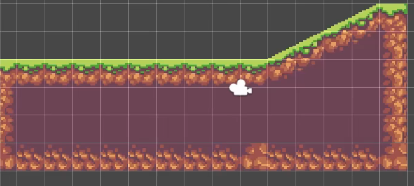
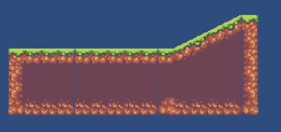
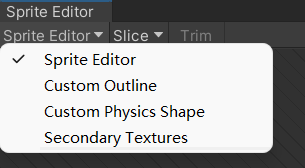
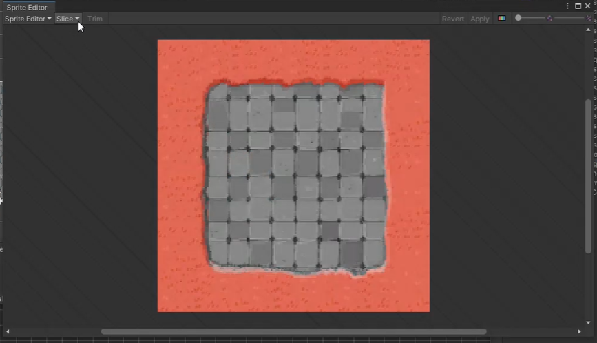
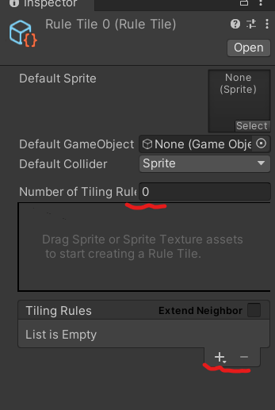
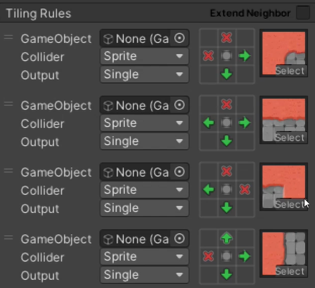

# Tilemap

## 1.地图撕裂的问题

**问题描述**：在 Scene 的地图拼接正常，但是 Game 会出现 “撕裂” 的问题。对比如下两幅图。

图1.2中存在明显的缝隙。

这是 Tilemap 自身存在的问题。

图1.1 Scene 窗口视图

图1.2 Game 窗口中的视图

**解决方法**：把 Grid 的 cell Size 的 x 轴和 y 轴设置为 0.99 。

## 2.切割图片的方法

**首先！：Texture Type 要选择 Sprite（2D and UI）选项！！** ，2D项目默认。

**其次**：需要裁剪**多个**元素，这里的 Sprte Mode 选择 Multiple。

**然后选择裁剪方式**：Sprite Editor 中的 Slice（切割）模式有四种：

1. **Automatic** 根据图像的像素点来识别单张图片，在面对非常多的图片时非常好用，裁剪好后只需要要对一部分图片进行微调

   但有时候面对一些图片时就没用了。

2. **Grid By Cell Size** 根据你自己定的多少像素点/横竖格子来裁剪的，面对摆放整齐的自然好用，但一般都是很难摆起的所有就没啥用。

3. **Grid By Cell Count** 根据你根据一张画布切割成**多少行多少列**，比较好用。

4. **Isometric Grid** 手动切割。

## 3.给图片设置碰撞体

**第一步：**：打开 Sprite Edite ,在 Sprite Edite 中选择 Custom Physics Shape

**第二步**：选择需要设置碰撞体的元素，鼠标点击图片拖动一定距离，出现白色边框，使用边框围起来 Apply 即可。

​		  或 选择需要设置碰撞体的元素，点击 Generate 即可自动按照图片边缘设置碰撞体，可以进行部分修改。

**第三步**：只需要在 Tilemap 中将元素拖入，然后在对应的 Tilemap 中添加 Tilemap Collider 2D 组件即可。

## 4.使用规则瓦片

**首先！**：如果创建不了 Rule-Tile 有两个方法解决：

1. 需要去下载一个2D-extras 的插件包，并解压在项目的 Assets文件夹中。

   [Unity-Technologies/2d-extras: Fun 2D Stuff that we'd like to share! (github.com)](https://github.com/Unity-Technologies/2d-extras)

2. 在 Window - Package Manager - 搜索 2D Tilemap Editor - 下载最新的。

**第一步**：裁剪需要使用的素材图片

**第二步**：在文件目录中右键 - create - 2D - Tiles - Rule tile ，创建一个规则瓦片，并将切割好的素材一个一个导入并设置规则。

结果如图：

> ❌可以理解为不能有东西，“🔜“表示可以有东西。

**最后一步**：将创建的 Rule Tile 瓦片导入到 Tile Palette 面板中，选择该瓦片绘制即可。

## 5.编程瓦片 Scriptable Tile

自己书写瓦片的绘制规则。暂未了解。

## 6.

