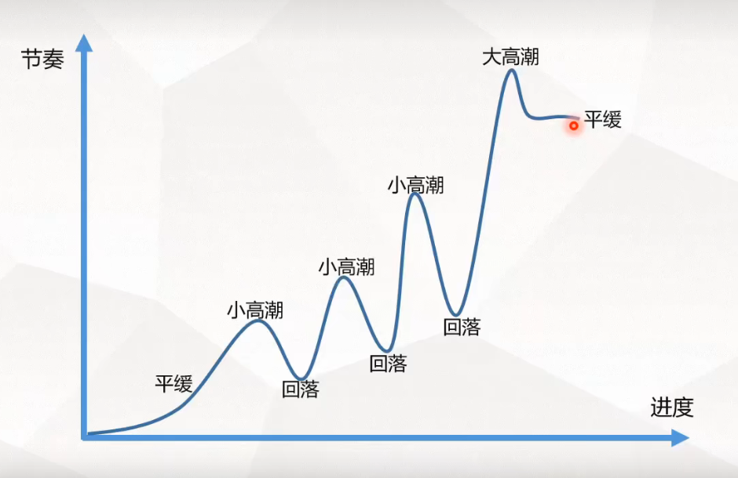

参考：

B站地址：[【游戏策划】全网最干活游戏关卡策划知识，阿伟都找不到这么全的，我说的!!_哔哩哔哩_bilibili](https://www.bilibili.com/video/BV1NV411v72x/?spm_id_from=333.788.recommend_more_video.-1&vd_source=fc54b2dc80b335df10be277ec2997673)

感悟：

1. 看一些跑团的书，**跑团是对TRPG（桌上角色扮演游戏）的一种俗称，是一种比较流行的桌上游戏形式**。
2. 懂得拆分关卡节点。
3. 善于借鉴。

# 关卡的定义

## 什么是游戏关卡？

关卡设计就是设计好的场景和物品，目标和任务，提供给玩家（游戏人物）一个活动的舞台。在这个舞台上，玩家表面上拥有有限的自由，而实际上关卡设计师通过精心布置，来把握玩家和游戏节奏并给与引导，最终达到一定的目的。关卡设计这个名词和关卡设计师这个职业，是20世纪90年代中后期，随着三维射击游戏的流行应运而生的，因此严格的说，应该称为三维关卡设计。

其实就是**角色从起点到终点的流程**。

# 关卡的节奏

## 节奏是什么？

节奏就是**正确的时间做正确的事**。

> 有张有弛，前松后紧。

玩家松弛的时候（**平缓、回落点**），不会认为关卡简单无聊。

玩家紧张的时候，不会认为关卡变态反人类。

控制长度、控制难度、控制频率。

# 关卡的难度

## 拆分

步骤：

1. 在节奏曲线上设置并拆分关键节点。
2. 在关键节点上拆分关键元素。

## 难度比较/难度基准

难不难得找出一个**难度的基准点**。

# 关卡的分类

# PVE关卡该如何设计

首先得明确关卡的**定位**：

1. 类型：

   它是剧情副本、玩法副本、资源副本？**剧情**就偏向演绎为主，重点在故事上。**玩法**就要侧重于它的复刷行和趣味性。资源要侧重于复刷性，根据游戏类型具体控制社交合作和副本难度。

2. 副本出现的时间：

   出现的时间决定它的难度，有可能对游戏的探索成都的不同

3. 体验

**第一步**：分析竞品，学习优点规避缺点。

**第二步**：根据副本的定位，确定它的主体内容，例如副本的时间长度、副本的美术风格、节奏变化。

**第三步**：对副本的流程框架进行设计，对关卡动线的规划。分区域的规划副本，设置战斗点，剧情点等，再对每一块区域详细设计，比如战斗点，根据战斗对象的战斗方式来规划相应的动线和战斗掩体。

**第四步**：细化内容，提高体验。

**第五步**：进行验证，收集意见。

**第六步**：反复迭代，即时沟通问题。

# 关卡需求

一般关卡的流水线：

环境需求 -> 当日时间 -> 什么地点 -> 允许玩家使用什么能力 -> 敌人种类 -> ... 

游戏性和叙事性的节奏。

